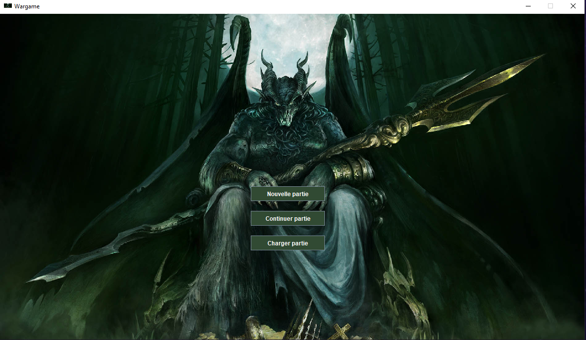

# jeu_2048

Jeu de guerre dans le monde du seigneur des anneaux en Java utilisant JavaSwing pour l'interface graphique

## Prérequis:
 - Installation des indépendances de java

## Jouer
 - Télécharger le fichier "WargameExec.jar"
 - Cliquer sur le fichier ou lancer "java -jar WargameExec.jar" depuis votre terminal